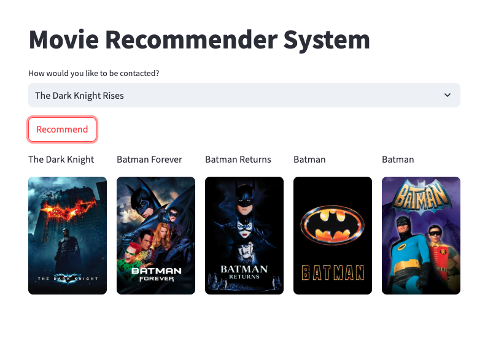

# Movie Recommender System



## Overview
This project is a content-based movie recommendation system that suggests movies similar to a user's movie of interest. The system analyzes movie features such as genre, director, actors, and plot to find movies with similar characteristics.

## Features
- Movie similarity calculation based on content features
- User-friendly interface to search and select movies
- Instant recommendations based on your movie selection
- Displays movie posters and basic information for recommended titles

## Tech Stack
- Python
- Streamlit (for the web interface)
- Scikit-learn (for similarity calculations)
- Pandas (for data manipulation)
- TMDB API (for movie data and posters)

## Installation

### Prerequisites
- Python 3.7+
- pip package manager

### Setup
1. Clone the repository
   ```
   git clone https://github.com/VineetKiragi/Movie_Recommender_System.git
   cd Movie_Recommender_System
   ```

2. Install required packages
   ```
   pip install -r requirements.txt
   ```

3. Get a TMDB API key
   - Create an account at [The Movie Database](https://www.themoviedb.org/)
   - Request an API key from your account settings
   - Add your API key to the `app.py` file

## Usage
1. Run the Streamlit app
   ```
   streamlit run app.py
   ```

2. Open your web browser and go to `http://localhost:8501`

3. Type the name of a movie you like in the search box

4. Select a movie from the dropdown

5. View the recommended movies similar to your selection

## Project Structure
```
Movie_Recommender_System/
├── app.py                  # Streamlit web application
├── model.pkl               # Trained model
├── movies_dict.pkl         # Movie data dictionary
├── tmdb_5000_credits.csv   # Movie credits dataset (not included in repo)
├── tmdb_5000_movies.csv    # Movie metadata dataset (not included in repo)
├── requirements.txt        # Project dependencies
└── README.md               # Project documentation
```

## Data Sources
The project uses the TMDB 5000 Movie Dataset, which includes metadata for about 5,000 movies from The Movie Database (TMDB).

## How It Works
1. The system preprocesses movie data to extract relevant features
2. Text vectorization transforms movie features into numerical form
3. Cosine similarity measures are calculated between movies
4. When a user selects a movie, the system finds movies with the highest similarity scores
5. Top matches are displayed as recommendations

## Future Improvements
- Implement collaborative filtering for personalized recommendations
- Add user ratings and review features
- Enhance UI with more movie details and trailers
- Improve recommendation accuracy with advanced NLP techniques

## Acknowledgements
- Data provided by [The Movie Database (TMDB)](https://www.themoviedb.org/)
- Dataset from [TMDB 5000 Movie Dataset](https://www.kaggle.com/tmdb/tmdb-movie-metadata) on Kaggle
